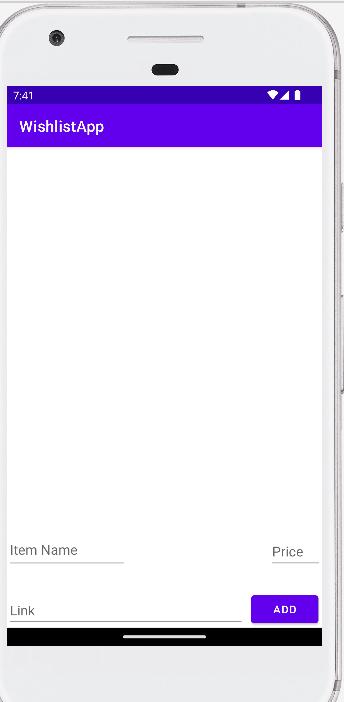

# Android Project 2 - *WishlistApp*

Submitted by: **Larry Mei**

**WishlistApp** is a wishlist app that helps the user keep track of what they want to buy.

Time spent: **7** hours spent in total

## Required Features

The following **required** functionality is completed:

- [x] **User can add an item to their wishlist**
- [x] **User can see their list of items based on previously inputted items**

The following **optional** features are implemented:

- [ ] Wishlist app is 🎨 **customized** 🎨
- [ ] User can delete an item by long pressing on the item
- [ ] User can open an item's URL by clicking on the item

The following **additional** features are implemented:

- [x] Made the RecyclerView scrollable while not overlapping with EditText and Button layouts

## Video Walkthrough

Here's a walkthrough of how the wishlist works:

GIF created with [ScreenToGif](https://www.screentogif.com/) for Windows

## Notes

Describe any challenges encountered while building the app.

I had trouble figuring out how to connect the RecyclerView code to MainActivity code. Once I figured it out, it appeared that only one item was appearing and any subsequent item would not be shown. But I realized that the items were shown but had an entire screen's worth of padding between them, so I changed the layout_height to wrap_content and the padding to 10dp to solve that issue. I also had an issue where the RecyclerView took the entire screen despite its height being around 3/4 of the screen. I fixed this by realizing that the RecyclerView was missing a constraint at the bottom so I added one.

## License

    Copyright [2022] [Larry Mei]

    Licensed under the Apache License, Version 2.0 (the "License");
    you may not use this file except in compliance with the License.
    You may obtain a copy of the License at

        http://www.apache.org/licenses/LICENSE-2.0

    Unless required by applicable law or agreed to in writing, software
    distributed under the License is distributed on an "AS IS" BASIS,
    WITHOUT WARRANTIES OR CONDITIONS OF ANY KIND, either express or implied.
    See the License for the specific language governing permissions and
    limitations under the License.
